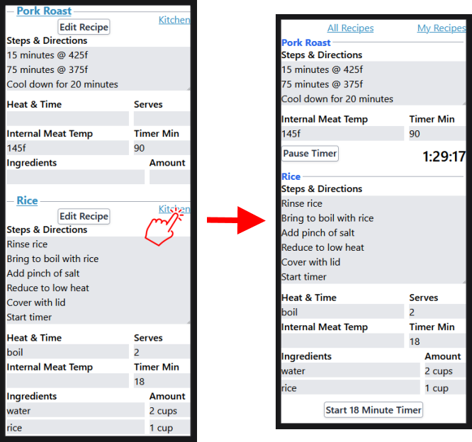

Phone-Recipes, [https://phone-recipes.herokuapp.com/](https://phone-recipes.herokuapp.com/), exists to help prepare
multiple dishes for a meal using a phone in the kitchen. A list of my online
<a href='https://phone-recipes.herokuapp.com/steenhansen1942/gmail.com'>recipes</a>.
Phone-recipes shows mulitple dishes along with timers. Log in with a
Google Account. Below are screen shots of of my
<a href='https://phone-recipes.herokuapp.com/steenhansen1942/gmail.com/Pork%20Roast/steenhansen1942/gmail.com/Rice'>Pork Roast with rice</a> recipes.

Rescources

- [vite-plugin-ssr](https://vite-plugin-ssr.com/) for Server-Side-Rending and Hot-Module-Replacement

- [Passport](https://www.passportjs.org/) OAuth 2.0 authentication via Google

- [React Hooks](https://reactjs.org/docs/hooks-intro.html)
- [Storybook](https://storybook.js.org/) for React component building

- [Selenuim](https://www.selenium.dev/) UI testing

- [Mongoose](https://mongoosejs.com/) for MongoDB objects

- [Tailwind](https://tailwindcss.com/) CSS

- [Icons](https://flaticon.com/) from flaticon.com

- [Type-Czech](https://github.com/steenhansen/type-czech) run time checking in development

Runs On

- [Heroku](https://www.heroku.com/)
- Locally along with a MongoDB [Compass](https://www.mongodb.com/products/compass) installation

Credentials Needed (examples in /sample-configs/)

- Local or [MongoDB Atlas](https://www.mongodb.com/cloud/atlas/lp/try2) MongoDB URI
- Google [OAuth 2.0](https://developers.google.com/identity/protocols/oauth2/openid-connect#appsetup) credentials

Prepare Node Environment

- nvm install 16.4.0

- nvm use 16.4.0

Run on Heroku

    npm run start, no Proc file needed

Test Heroku environment locally with Atlas DB, local MongoDB Compass must be connected also for some reason

    npm run prod ../heroku-config.js

Local Dev Run

    npm run dev ../dev-config.js

Local Prod Run

    npm run prod ../prod-config.js

Selenium Tests

- Close all FireFox windows, tests use a lot of resources. If fail try again.
  If still fail check hard drive free space. Possibly reboot after empty trash.

- terminal 1:

       npm run dev /test-selenium/selenium-config.js

- terminal 2:

       cd test-selenium
       node all-selenium-tests

- NB, close Firefox windows after every test as gigabytes of hard
  drive space are used

Vitest JSX tests

    npx vitest /test-jsx-browser

Mocha Node.js tests

    npm run test-node

Storybook

    npm run show-storybook
